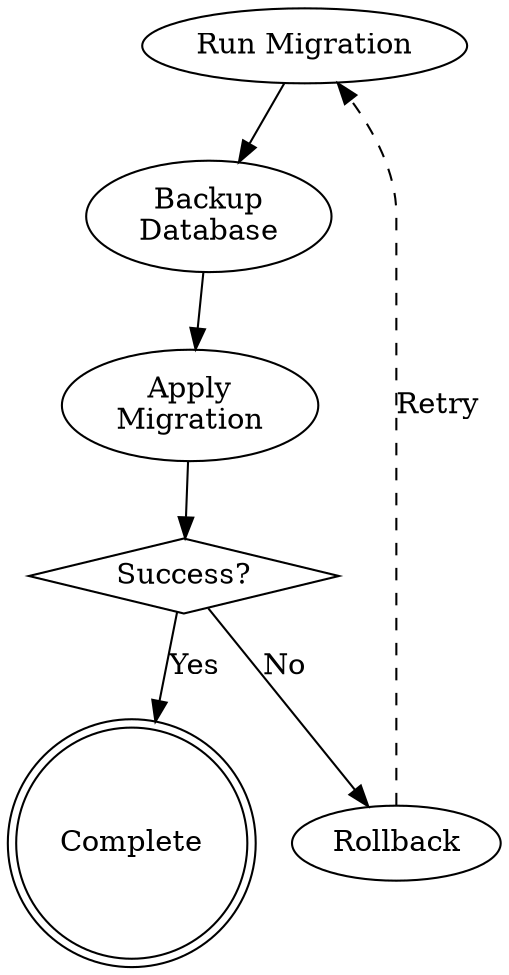

# Graphviz Documentation - 12-Factor Agent Compliance Mapping

**Version**: 1.0.0
**Status**: Compliance Reference
**Last Updated**: 2025-11-01

---

## Overview

This document maps Graphviz process documentation to the 12-Factor Agent methodology, demonstrating how visual `.dot` diagrams support each of the 12 factors.

---

## Factor 1: Codebase (One codebase tracked in revision control)

### How Graphviz Supports Factor 1

**.dot files are code**, tracked in version control alongside implementation:

```
git add skills/my-skill/skill-process.dot
git commit -m "Update workflow to add validation step"
git push origin main
```

### Benefits

- **Version History**: See how workflows evolve over time
- **Diff Visualization**: Git diffs show structural changes clearly
- **Branch Management**: Different branches can have different workflow diagrams
- **Deployment Consistency**: Same diagram deploys to all environments

### Example

```bash
# View workflow changes
git diff main feature/new-workflow -- skills/*/skill-process.dot

# Merge workflow updates
git merge feature/improved-coordination
```

---

## Factor 2: Dependencies (Explicitly declare and isolate dependencies)

### How Graphviz Supports Factor 2

Workflow diagrams can document dependency checks:

```dot
subgraph cluster_dependencies {
  label="Dependency Validation";

  check_node_version [shape=diamond, label="Node ≥ 18?"];
  check_graphviz [shape=diamond, label="Graphviz\nInstalled?"];
  check_mcp_servers [shape=diamond, label="MCP Servers\nConnected?"];

  dependency_error [shape=octagon, fillcolor=crimson,
                    label="BLOCKED\nMissing Dependencies"];

  check_node_version -> check_graphviz [label="Yes"];
  check_node_version -> dependency_error [label="No"];
  check_graphviz -> check_mcp_servers [label="Yes"];
  check_graphviz -> dependency_error [label="No"];
}
```

### Benefits

- Documents required dependencies visually
- Shows dependency validation flow
- Makes isolation requirements explicit

---

## Factor 3: Config (Store config in environment)

### How Graphviz Supports Factor 3

Diagrams can document config loading and validation:

```dot
subgraph cluster_config {
  label="Configuration Phase";

  load_env [label="Load .env\nVariables"];
  validate_required [shape=diamond, label="Required\nVars Present?"];
  check_secrets [shape=diamond, label="No Hardcoded\nSecrets?"];

  secrets_violation [shape=octagon, fillcolor=crimson,
                     label="BLOCKED\nSecrets in Code"];

  load_env -> validate_required;
  validate_required -> check_secrets [label="Yes"];
  check_secrets -> secrets_violation [label="Secrets Found"];
}
```

### Benefits

- Shows config loading sequence
- Documents validation steps
- Makes secret handling explicit

---

## Factor 4: Backing Services (Treat backing services as attached resources)

### How Graphviz Supports Factor 4

Diagrams show service attachment and swappability:

```dot
subgraph cluster_services {
  label="Backing Services";

  app [label="Agent"];
  db [label="Database\n(PostgreSQL)", shape=cylinder];
  cache [label="Cache\n(Redis)", shape=cylinder];
  queue [label="Queue\n(RabbitMQ)", shape=cylinder];

  app -> db [label="Config: DB_URL"];
  app -> cache [label="Config: CACHE_URL"];
  app -> queue [label="Config: QUEUE_URL"];
}
```

### Benefits

- Shows service boundaries
- Documents config-based attachment
- Visualizes swappability

---

## Factor 5: Build, Release, Run (Strictly separate build and run stages)

### How Graphviz Supports Factor 5

Diagrams document the build/release/run pipeline:

```dot
subgraph cluster_build {
  label="Build Stage";
  compile [label="Compile Code"];
  bundle [label="Bundle Assets"];
  test [label="Run Tests"];
}

subgraph cluster_release {
  label="Release Stage";
  combine [label="Combine Build\n+ Config"];
  tag [label="Tag Release"];
}

subgraph cluster_run {
  label="Run Stage";
  deploy [label="Deploy to\nEnvironment"];
  start [label="Start Process"];
}

compile -> bundle -> test -> combine;
combine -> tag -> deploy -> start;
```

### Benefits

- Clear stage separation
- Documents immutable releases
- Shows deployment flow

---

## Factor 6: Processes (Execute as stateless processes)

### How Graphviz Supports Factor 6

Diagrams show stateless process design:

```dot
request [label="Request", shape=ellipse];
process [label="Stateless\nProcess"];
backing_store [label="Backing Store\n(State)", shape=cylinder];
response [label="Response", shape=doublecircle];

request -> process;
process -> backing_store [label="Read/Write State"];
backing_store -> process;
process -> response;
```

### Benefits

- Shows state externalization
- Documents share-nothing architecture
- Clarifies process lifecycle

---

## Factor 7: Port Binding (Export services via port binding)

### How Graphviz Supports Factor 7

Diagrams document service exposure:

```dot
agent [label="Agent Service"];
port [label="Port\n(env.PORT)", shape=hexagon];
client [label="Client"];

agent -> port [label="Bind"];
client -> port [label="Connect"];
port -> agent [label="Route"];
```

### Benefits

- Shows port binding explicitly
- Documents self-contained service
- Clarifies service boundaries

---

## Factor 8: Concurrency (Scale out via process model)

### How Graphviz Supports Factor 8

Diagrams show horizontal scaling:

```dot
load_balancer [label="Load Balancer"];

subgraph cluster_instances {
  label="Horizontally Scaled Instances";

  instance_1 [label="Agent\nInstance 1"];
  instance_2 [label="Agent\nInstance 2"];
  instance_3 [label="Agent\nInstance 3"];
}

load_balancer -> instance_1;
load_balancer -> instance_2;
load_balancer -> instance_3;
```

### Benefits

- Shows process-based concurrency
- Documents scaling model
- Visualizes load distribution

---

## Factor 9: Disposability (Maximize robustness with fast startup and graceful shutdown)

### How Graphviz Supports Factor 9

Diagrams document startup/shutdown flows:

```dot
subgraph cluster_startup {
  label="Fast Startup (< 5s)";

  init [label="Initialize"];
  load_config [label="Load Config"];
  ready [label="Ready", shape=doublecircle];

  init -> load_config -> ready;
}

subgraph cluster_shutdown {
  label="Graceful Shutdown";

  signal [label="SIGTERM", shape=ellipse];
  finish_requests [label="Finish\nIn-Flight"];
  cleanup [label="Cleanup"];
  exit [label="Exit", shape=doublecircle];

  signal -> finish_requests -> cleanup -> exit;
}
```

### Benefits

- Documents fast startup requirements
- Shows graceful shutdown steps
- Makes robustness explicit

---

## Factor 10: Dev/Prod Parity (Keep development, staging, and production as similar as possible)

### How Graphviz Supports Factor 10

Diagrams apply uniformly across environments:

```dot
subgraph cluster_dev {
  label="Development";
  dev_agent [label="Agent"];
  dev_db [label="PostgreSQL\n(Local)"];
  dev_agent -> dev_db;
}

subgraph cluster_prod {
  label="Production";
  prod_agent [label="Agent"];
  prod_db [label="PostgreSQL\n(Cloud)"];
  prod_agent -> prod_db;
}

// Same structure, different backing services
```

### Benefits

- Same workflow diagrams for all environments
- Documents parity requirements
- Visualizes environment differences

---

## Factor 11: Logs (Treat logs as event streams)

### How Graphviz Supports Factor 11

Diagrams document logging flow:

```dot
agent [label="Agent"];
stdout [label="stdout", shape=plaintext];
log_router [label="Log Router"];
log_storage [label="Log Storage", shape=cylinder];

agent -> stdout [label="Write Events"];
stdout -> log_router [label="Stream"];
log_router -> log_storage [label="Aggregate"];
```

### Benefits

- Shows logs as streams
- Documents event flow
- Clarifies observability architecture

### Application to Debugging

Workflow diagrams aid log interpretation:

```
ERROR: Reached state "validation_failed" in agent-execution.dot
TRACE: Following error recovery path: validation_failed -> retry_logic
```

Engineers can follow the diagram to understand execution flow.

---

## Factor 12: Admin Processes (Run admin/management tasks as one-off processes)

### How Graphviz Supports Factor 12

Diagrams document admin workflows:



### Benefits

- Documents one-off processes
- Shows admin workflow steps
- Makes procedures explicit

---

## Integration with 12-FA Validation

### Automated Compliance Checking

Use workflow diagrams in compliance validation:

```javascript
async function validate12FACompliance(agentPath) {
  const agentYaml = await loadAgentYaml(agentPath);
  const diagrams = agentYaml.documentation.process_diagrams;

  // Check if workflow includes config validation
  const hasConfigValidation = await checkDiagramForPattern(
    diagrams,
    /check_.*config|load_env|validate_env/i
  );

  if (!hasConfigValidation) {
    return {
      factor: 3,
      compliant: false,
      message: 'Workflow missing config validation step'
    };
  }

  // Check if workflow includes dependency checks
  const hasDependencyCheck = await checkDiagramForPattern(
    diagrams,
    /check_dependencies|validate_dependencies/i
  );

  if (!hasDependencyCheck) {
    return {
      factor: 2,
      compliant: false,
      message: 'Workflow missing dependency validation'
    };
  }

  return { compliant: true };
}
```

---

## Workflow Templates for 12-FA Patterns

### Config-Driven Service Template

```dot
subgraph cluster_12fa_pattern {
  label="12-FA Compliant Service";

  // Factor 3: Config from environment
  load_config [label="Load Config\nfrom Environment"];

  // Factor 2: Check dependencies
  check_deps [label="Validate\nDependencies"];

  // Factor 4: Attach backing services
  attach_services [label="Attach\nBacking Services"];

  // Factor 6: Stateless process
  stateless_process [label="Stateless\nProcess"];

  // Factor 11: Log to stdout
  log_stream [label="Stream Logs\nto stdout"];

  load_config -> check_deps -> attach_services -> stateless_process -> log_stream;
}
```

---

## CI/CD Integration

### Diagram Validation in Pipeline

```yaml
# .github/workflows/12fa-validation.yml
name: 12-FA Validation

on: [push, pull_request]

jobs:
  validate-diagrams:
    runs-on: ubuntu-latest
    steps:
      - uses: actions/checkout@v2

      - name: Install Graphviz
        run: sudo apt-get install graphviz

      - name: Validate .dot files
        run: node tools/graphviz-validator.js --all

      - name: Check 12-FA compliance
        run: node tools/12fa-validator.js --check-diagrams
```

---

## Summary

Graphviz diagrams support 12-FA by:

1. ✅ **Factor 1**: Version-controlled workflow documentation
2. ✅ **Factor 2**: Visualizing dependency validation
3. ✅ **Factor 3**: Documenting config loading
4. ✅ **Factor 4**: Showing service attachment
5. ✅ **Factor 5**: Separating build/release/run
6. ✅ **Factor 6**: Clarifying stateless processes
7. ✅ **Factor 7**: Documenting port binding
8. ✅ **Factor 8**: Showing horizontal scaling
9. ✅ **Factor 9**: Documenting startup/shutdown
10. ✅ **Factor 10**: Uniform across environments
11. ✅ **Factor 11**: Aiding log interpretation
12. ✅ **Factor 12**: Documenting admin processes

By integrating visual workflows, we create **self-documenting, 12-FA compliant agents** where the diagram IS the specification.

---

**References**:
- [12-Factor Agent Methodology](https://12fa.org)
- [Graphviz Process Documentation Guide](./graphviz-process-documentation.md)
- [12-FA Compliance Check Example](../../examples/12fa/graphviz/12fa-compliance-check.dot)
