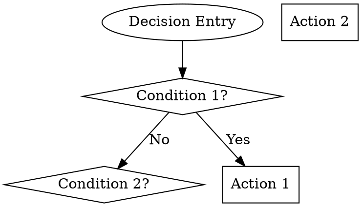
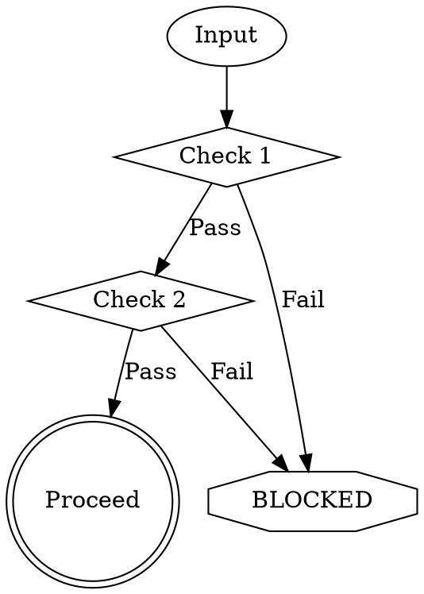
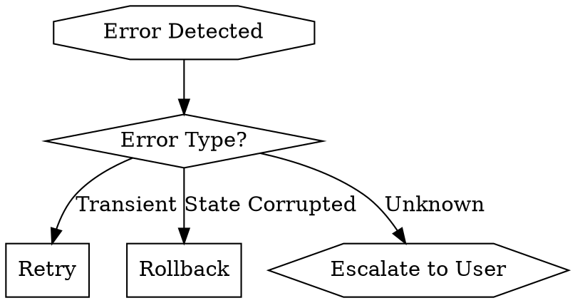
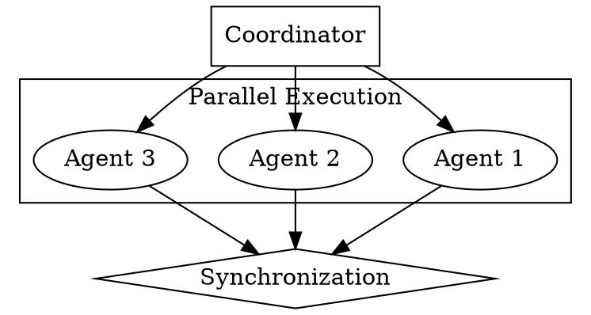
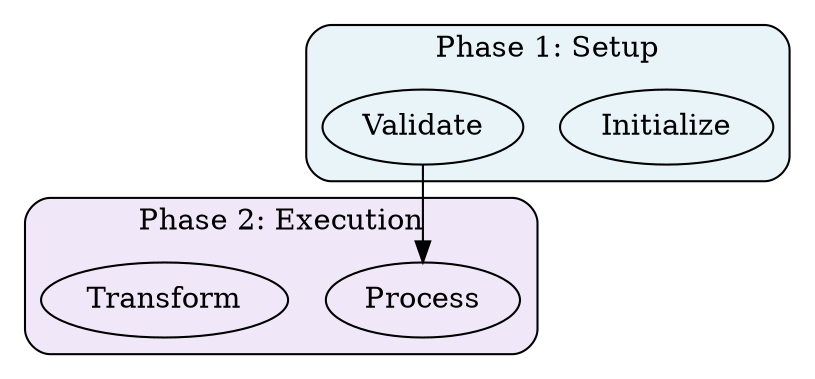

# Graphviz Process Documentation Layer for 12-Factor Agents

**Version**: 1.0.0
**Status**: Production-Ready
**Integration**: 12-FA Core System
**Author**: System Architecture Team
**Last Updated**: 2025-11-01

---

## Table of Contents

1. [Core Principles](#core-principles)
2. [Syntax Patterns & Conventions](#syntax-patterns--conventions)
3. [Documentation Types](#documentation-types)
4. [Integration Patterns](#integration-patterns)
5. [Best Practices](#best-practices)
6. [Anti-Patterns](#anti-patterns)
7. [Templates](#templates)
8. [Advanced Techniques](#advanced-techniques)
9. [12-FA Integration](#12-fa-integration)

---

## Core Principles

### Why Graphviz for AI Comprehension

Based on the groundbreaking work at fsck.com, we've adopted Graphviz `.dot` language as the **primary method for documenting complex agent workflows**. This isn't about creating diagrams for humans—it's about creating **unambiguous specifications for AI agents**.

#### The Clarity Advantage

> "Claude seems better at understanding and following rules written as dot"
> — fsck.com research findings

**Key Benefits:**

1. **Eliminates Ambiguity**: Natural language specifications leave room for interpretation. Dot diagrams provide explicit, graph-based rules.

2. **Visual Rule Enforcement**: Rule violations can be represented as distinct visual elements (red octagons), making them impossible to miss.

3. **State Machine Clarity**: Complex workflows become explicit state machines with clear transitions.

4. **Parallel Process Visualization**: Multiple agents working concurrently can be represented as subgraph clusters.

5. **Self-Documenting**: The diagram IS the specification. No translation layer needed.

#### Traditional Markdown vs. Graphviz

| Aspect | Markdown Documentation | Graphviz .dot |
|--------|----------------------|---------------|
| **Ambiguity** | High (prose is interpretable) | Minimal (graph structure is explicit) |
| **AI Parsing** | NLP-dependent, context-sensitive | Direct graph traversal |
| **Rule Visualization** | Buried in text | Visually distinct nodes |
| **Process Flow** | Sequential narrative | Explicit state transitions |
| **Decision Points** | Implicit in conditionals | Diamond-shaped decision nodes |
| **Parallel Processes** | Difficult to represent | Subgraph clusters |
| **Validation** | Manual interpretation | Automated graph validation |

#### When Graphviz Excels

Use `.dot` diagrams for:

- ✅ **Workflow processes**: TDD cycles, deployment pipelines
- ✅ **Decision trees**: When to ask user vs. proceed autonomously
- ✅ **Quality gates**: Validation checkpoints and blocking conditions
- ✅ **Error recovery**: Debugging flows and fallback strategies
- ✅ **Multi-agent coordination**: Parallel execution and synchronization
- ✅ **Rule hierarchies**: Policy enforcement and compliance checking

#### When to Use Markdown Instead

Markdown remains appropriate for:

- ❌ **Static reference material**: API documentation, configuration schemas
- ❌ **Conceptual explanations**: Architectural philosophies, design patterns
- ❌ **Code examples**: Syntax demonstrations, usage patterns
- ❌ **Installation guides**: Step-by-step setup instructions
- ❌ **Changelog/release notes**: Linear historical records

### Integration with 12-Factor Agents

Graphviz documentation integrates with multiple 12-FA factors:

#### Factor 1: Codebase (One codebase tracked in version control)

- `.dot` files live alongside code in version control
- Process diagrams evolve with implementation
- Git diffs show workflow changes explicitly

#### Factor 11: Logs & Observability

- Visual workflows aid in understanding system behavior
- Process diagrams help trace execution paths
- Debugging flows guide incident response

#### Factor 12: Admin Processes

- Administrative tasks documented as visual workflows
- One-off scripts represented as decision trees
- Maintenance procedures explicitly diagrammed

---

## Syntax Patterns & Conventions

### Standard Node Shapes

We adopt a **semantic shape convention** for consistent interpretation:

```dot
// Entry and Exit Points
shape=ellipse          → Start/End points, trigger events
shape=doublecircle     → Major completion states, success nodes

// Process Nodes
shape=box              → Standard actions, processes, implementations
shape=rectangle        → Same as box (alternative syntax)

// Decision Points
shape=diamond          → Conditional branches, validation checks

// Critical States
shape=octagon          → Warnings, stops, rule violations
shape=hexagon          → Manual interventions, user prompts

// Grouping
subgraph cluster_X     → Logical groupings of related nodes
```

#### Shape Semantics Table

| Shape | Semantic Meaning | When to Use |
|-------|------------------|-------------|
| `ellipse` | Entry/Exit point | Workflow start, external triggers |
| `doublecircle` | Major milestone | Successful completion, major gates |
| `box` / `rectangle` | Standard process | Most actions and processes |
| `diamond` | Decision point | Conditional branches, validations |
| `octagon` | Warning/Stop | Rule violations, critical errors |
| `hexagon` | Manual intervention | User prompts, approval gates |
| `plaintext` | Label/Command | Actual command text, annotations |

### Color Conventions

Colors carry **semantic meaning** in our system:

```dot
// Entry Points
fillcolor=lightblue    → Workflow entry, initialization phase

// Implementation Phases
fillcolor=purple       → Core implementation steps
fillcolor=blue         → Secondary processes

// Quality & Success
fillcolor=green        → Success states, validation passed
fillcolor=lightgreen   → Optional optimizations

// Warnings & Errors
fillcolor=yellow       → Minor warnings, optional checks
fillcolor=orange       → Significant warnings, debugging
fillcolor=crimson      → Critical violations, blocking errors
fillcolor=red          → Fatal errors, system failures

// Special States
fillcolor=gray         → Deprecated/inactive paths
fillcolor=white        → Default/neutral states
```

#### Color Semantics Table

| Color | Meaning | Node Types |
|-------|---------|------------|
| `lightblue` | Initialization | Entry points, setup phases |
| `purple` | Core implementation | Primary workflow steps |
| `green` | Success/validation | Completion nodes, passed checks |
| `orange` | Warning/debugging | Non-blocking issues, diagnostics |
| `crimson` | Rule violation | Blocking errors, policy failures |
| `red` | Fatal error | System failures, crashes |
| `yellow` | Caution | Minor issues, optional steps |
| `gray` | Inactive/deprecated | Disabled paths, legacy flows |

### Style Attributes

Additional visual attributes for clarity:

```dot
// Node Styles
style="filled"                    → Solid fill (default for important nodes)
style="rounded,filled"            → Rounded corners (softer, recommended)
style="dashed"                    → Optional/conditional paths
style="bold"                      → Emphasized critical nodes
style="dotted"                    → Informational flows

// Edge Styles
edge [style=solid]                → Standard transitions
edge [style=dashed]               → Optional/conditional transitions
edge [style=bold]                 → Critical path, main flow
edge [style=dotted, color=gray]   → Informational connections

// Subgraph Styles
style="filled,rounded"            → Standard subgraph appearance
color="darkblue"                  → Border color for cluster
bgcolor="#F0F0F0"                 → Background color (light recommended)
```

### Layout Directives

Control diagram flow direction:

```dot
// Top to bottom (default, recommended for workflows)
rankdir=TB;

// Left to right (good for wide decision trees)
rankdir=LR;

// Bottom to top (rare, for reverse flows)
rankdir=BT;

// Right to left (rare, for RTL languages)
rankdir=RL;
```

### Edge Labels and Annotations

Label transitions clearly:

```dot
// Simple label
node1 -> node2 [label="success"];

// Conditional label with color
node1 -> node2 [label="validation passed", color=green];
node1 -> node3 [label="validation failed", color=red];

// Multiple conditions (use \n for newlines)
decision -> action [label="condition A\nOR condition B"];

// Probability/weight annotations
choice -> path1 [label="80%", weight=8];
choice -> path2 [label="20%", weight=2];
```

---

## Documentation Types

### 1. Workflow Process Diagrams

**Purpose**: Document sequential and parallel execution flows

**Use Cases**:
- TDD implementation cycles
- Deployment pipelines
- Skill execution workflows
- Multi-agent coordination

**Structure**:
```dot
digraph WorkflowName {
  rankdir=TB;

  subgraph cluster_init { /* Initialization */ }
  subgraph cluster_exec { /* Execution */ }
  subgraph cluster_validate { /* Validation */ }
  subgraph cluster_complete { /* Completion */ }
}
```

**Key Elements**:
- Clear entry point (ellipse)
- Phased subgraphs (initialization → execution → validation → completion)
- Decision points for branching logic
- Error handling paths
- Completion state (doublecircle)

### 2. Decision Trees

**Purpose**: Document conditional logic and branching decisions

**Use Cases**:
- When to ask user vs. proceed autonomously
- Agent selection based on task type
- Configuration validation logic
- Error classification and routing

**Structure**:


**Key Elements**:
- Diamond nodes for all decisions
- Clear boolean labels on edges (Yes/No, True/False)
- Leaf nodes as actions
- Complete coverage (no dangling decisions)

### 3. Quality Gate Diagrams

**Purpose**: Document validation checkpoints and blocking conditions

**Use Cases**:
- 12-FA compliance validation
- Security policy enforcement
- Test coverage requirements
- Code review criteria

**Structure**:


**Key Elements**:
- Sequential validation checks
- Explicit blocking states (octagon, crimson)
- Success path clearly marked
- No bypasses around validations

### 4. Error Recovery Flows

**Purpose**: Document debugging procedures and fallback strategies

**Use Cases**:
- Build failure recovery
- Test failure debugging
- Deployment rollback procedures
- Agent failure handling

**Structure**:


**Key Elements**:
- Error classification logic
- Automated recovery paths
- Manual intervention points (hexagon)
- Logging and notification nodes

### 5. Multi-Agent Coordination

**Purpose**: Document parallel agent execution and synchronization

**Use Cases**:
- Parallel skill execution
- Multi-agent swarm coordination
- Distributed task processing
- Concurrent file operations

**Structure**:


**Key Elements**:
- Clear coordinator node
- Subgraph clusters for parallel agents
- Synchronization points (diamond)
- Result aggregation logic

---

## Integration Patterns

### File System Organization

Our standard structure places `.dot` files alongside their corresponding code:

```
project/
├── skills/
│   ├── my-skill/
│   │   ├── skill.yaml                 # Metadata
│   │   ├── skill.md                   # Human documentation
│   │   ├── skill-process.dot          # Workflow diagram
│   │   ├── skill-decisions.dot        # Decision tree
│   │   └── src/
│   │       └── index.js               # Implementation
│
├── agents/
│   ├── my-agent/
│   │   ├── agent.yaml                 # 12-FA specification
│   │   ├── agent.md                   # Description
│   │   ├── agent-coordination.dot     # Multi-agent flow
│   │   ├── agent-execution.dot        # Single-agent workflow
│   │   └── agent-decisions.dot        # Decision logic
│
├── commands/
│   ├── my-command.md                  # Command documentation
│   └── my-command-flow.dot            # Execution flow
│
└── templates/
    ├── skill-process.dot.template
    ├── agent-coordination.dot.template
    └── decision-tree.dot.template
```

### Integration with agent.yaml

Extend the agent manifest to reference `.dot` files:

```yaml
# agent.yaml
name: my-agent
version: 1.0.0

documentation:
  markdown: ./agent.md
  process_diagrams:
    - name: coordination_flow
      path: ./agent-coordination.dot
      type: workflow
      description: Multi-agent coordination pattern

    - name: execution_process
      path: ./agent-execution.dot
      type: workflow
      description: Single-agent execution workflow

    - name: decision_tree
      path: ./agent-decisions.dot
      type: decision_tree
      description: Agent decision logic

visualization:
  enabled: true
  auto_generate: true
  formats: [svg, png, dot]
  output_dir: ./docs/diagrams
```

### Integration with skill.yaml

Similarly for skills:

```yaml
# skill.yaml
name: my-skill
version: 1.0.0

documentation:
  markdown: ./skill.md
  process_diagrams:
    - name: workflow
      path: ./skill-process.dot
      type: workflow

    - name: decisions
      path: ./skill-decisions.dot
      type: decision_tree

visualization:
  enabled: true
  formats: [svg]
```

### Automatic Generation in skill-creator

When creating a new skill, `skill-creator` should:

1. **Prompt for workflow type**:
   - Linear (sequential steps)
   - Branching (conditional logic)
   - Cyclical (iterative processes)
   - Parallel (concurrent operations)

2. **Generate base `.dot` file** from template

3. **Populate with skill-specific steps** from specification

4. **Validate syntax** before saving

5. **Add reference to `skill.yaml`**

### Automatic Generation in agent-creator

When creating a new agent, `agent-creator` should:

1. **Analyze agent type**:
   - Single-agent (execution workflow)
   - Multi-agent (coordination pattern)
   - Coordinator (orchestration logic)

2. **Generate appropriate `.dot` files**:
   - `agent-execution.dot` for all agents
   - `agent-coordination.dot` for coordinators
   - `agent-decisions.dot` if complex logic present

3. **Embed references in `agent.yaml`**

4. **Validate and render preview**

---

## Best Practices

### 1. Use Subgraphs for Logical Phases

Organize complex workflows into phases:



**Benefits**:
- Visual separation of concerns
- Clear phase boundaries
- Easier to understand large workflows

### 2. Make Rule Violations Visually Distinct

Don't bury critical rules—make them stand out:

```dot
// ❌ BAD: Rule hidden in process
validate [label="Validate\n(must pass rule #3)"];

// ✅ GOOD: Rule violation is distinct node
validate [shape=diamond, label="Passes Rule #3?"];
violation [shape=octagon, fillcolor=crimson,
           label="BLOCKED: Rule #3 Violation"];

validate -> violation [label="No"];
```

### 3. Embed Critical Rules Throughout

Don't assume agents read the entire diagram first:

```dot
// Repeat critical rules at key decision points
check1 -> process1 [label="Proceed"];
check1 -> stop1 [label="Rule #5: No secrets in root"];

// Later in workflow, reference the same rule
check2 -> process2 [label="Proceed"];
check2 -> stop2 [label="Rule #5: No secrets in root"];
```

### 4. Show Parallel Processes with Clusters

Use subgraph clusters for concurrent operations:

```dot
subgraph cluster_parallel {
  label="Parallel Agent Execution";
  style="filled,rounded";
  bgcolor="#FFF8E8";

  agent1 [label="Research Agent"];
  agent2 [label="Coder Agent"];
  agent3 [label="Tester Agent"];
}

coordinator -> agent1 [label="Task 1"];
coordinator -> agent2 [label="Task 2"];
coordinator -> agent3 [label="Task 3"];
```

### 5. Use Plaintext for Actual Commands

When showing command execution:

```dot
execute [shape=plaintext, label="npx claude-flow hooks pre-task"];
```

This clearly distinguishes command literals from conceptual nodes.

### 6. Iterate Until Flow is Correct

The fsck.com article mentions **~12 rounds of iteration**. Don't expect perfection on first draft:

1. **Draft**: Create initial structure
2. **Review**: Walk through each path
3. **Test**: Have AI agent parse and explain
4. **Refine**: Add missing edges, clarify labels
5. **Validate**: Check for dangling nodes
6. **Repeat**: Until agent comprehension is perfect

### 7. Include Legend for Complex Diagrams

For large diagrams, include a legend subgraph:

```dot
subgraph cluster_legend {
  label="Legend";
  rank=sink;
  style="filled,rounded";
  bgcolor="#F8F8F8";

  legend_start [shape=ellipse, label="Entry Point"];
  legend_decision [shape=diamond, label="Decision"];
  legend_process [shape=box, label="Process"];
  legend_block [shape=octagon, fillcolor=crimson, label="Blocker"];
  legend_success [shape=doublecircle, fillcolor=green, label="Success"];

  // Hide from layout
  legend_start -> legend_decision [style=invis];
}
```

---

## Anti-Patterns

### 1. Over-Complex Graphs with Cross-Connections

**Problem**: Too many edges create visual spaghetti

```dot
// ❌ BAD: Cross-connections everywhere
node1 -> node2;
node1 -> node3;
node1 -> node5;
node2 -> node4;
node2 -> node6;
node3 -> node4;
node3 -> node5;
// ... creates unmaintainable mess
```

**Solution**: Break into subgraphs or separate diagrams

```dot
// ✅ GOOD: Clear hierarchical flow
subgraph cluster_A {
  node1 -> node2;
  node2 -> node3;
}

subgraph cluster_B {
  node4 -> node5;
  node5 -> node6;
}

node3 -> node4;  // Only one cross-cluster edge
```

### 2. Separating Continuous Processes

**Problem**: Breaking naturally continuous flow into disconnected boxes

```dot
// ❌ BAD: Implies these are independent
step1 [label="Read file"];
step2 [label="Parse JSON"];
step3 [label="Validate schema"];
// No edges connecting them
```

**Solution**: Show explicit flow

```dot
// ✅ GOOD: Clear sequential dependency
step1 [label="Read file"];
step2 [label="Parse JSON"];
step3 [label="Validate schema"];

step1 -> step2 -> step3;
```

### 3. Academic Hierarchies Divorced from Workflow

**Problem**: Creating organizational charts instead of process flows

```dot
// ❌ BAD: This is an org chart, not a workflow
CEO -> CTO;
CEO -> CFO;
CTO -> Engineer;
// Doesn't show actual process
```

**Solution**: Focus on process flow, not organizational structure

```dot
// ✅ GOOD: Shows actual work coordination
coordinator [label="Coordinator Agent"];
researcher [label="Research Agent"];
implementer [label="Implementation Agent"];

coordinator -> researcher [label="Assign research"];
researcher -> implementer [label="Pass findings"];
```

### 4. Using Emoji/Unicode in Labels

**Problem**: Graphviz rendering engines may not support Unicode properly

```dot
// ❌ BAD: May not render correctly
node1 [label="✅ Success"];
node2 [label="❌ Failure"];
```

**Solution**: Use colors and shapes for semantics

```dot
// ✅ GOOD: Visual distinction without emoji
node1 [label="Success", shape=doublecircle, fillcolor=green];
node2 [label="Failure", shape=octagon, fillcolor=crimson];
```

### 5. Missing Error Paths

**Problem**: Only showing the "happy path"

```dot
// ❌ BAD: What happens if validation fails?
input -> validate -> process -> output;
```

**Solution**: Document all paths, especially errors

```dot
// ✅ GOOD: Complete coverage
input -> validate;
validate -> process [label="Valid"];
validate -> error_handler [label="Invalid"];
error_handler -> input [label="Retry"];
process -> output;
```

### 6. Inconsistent Naming Conventions

**Problem**: Random capitalization and naming

```dot
// ❌ BAD: Inconsistent style
Node_One [label="First Step"];
node_two [label="second step"];
NODETHREE [label="Third step"];
```

**Solution**: Use consistent naming convention

```dot
// ✅ GOOD: Consistent snake_case for IDs, Title Case for labels
node_one [label="First Step"];
node_two [label="Second Step"];
node_three [label="Third Step"];
```

---

## Templates

### Skill Workflow Template

See `templates/skill-process.dot.template` for full template.

**Usage**:
```bash
cp templates/skill-process.dot.template skills/my-skill/skill-process.dot
# Edit placeholders: SKILL_NAME, process steps
```

### Agent Coordination Template

See `templates/agent-coordination.dot.template` for full template.

**Usage**:
```bash
cp templates/agent-coordination.dot.template agents/my-agent/agent-coordination.dot
# Edit placeholders: AGENT_NAME, coordination logic
```

### Decision Tree Template

See `templates/decision-tree.dot.template` for full template.

**Usage**:
```bash
cp templates/decision-tree.dot.template my-decisions.dot
# Add decision nodes and branches
```

### TDD Cycle Template

See `templates/tdd-cycle.dot.template` for full template.

**Usage**:
Represents classic Red-Green-Refactor TDD cycle with 12-FA compliance checks.

### Command Flow Template

See `templates/command-flow.dot.template` for full template.

**Usage**:
Documents slash command execution flow.

---

## Advanced Techniques

### Weighted Edges for Priority

Show relative priority or frequency:

```dot
decision -> path_common [weight=10, label="90%", penwidth=3];
decision -> path_rare [weight=1, label="10%", penwidth=1];
```

### Constraint-Based Layout

Force specific nodes to same rank:

```dot
{rank=same; node1; node2; node3;}
```

### Invisible Edges for Alignment

Align nodes without visible connection:

```dot
node1 -> node2 [style=invis];
```

### HTML-Like Labels

Use HTML formatting in labels:

```dot
node1 [label=<
  <TABLE BORDER="0" CELLBORDER="1" CELLSPACING="0">
    <TR><TD><B>Process Name</B></TD></TR>
    <TR><TD>Details here</TD></TR>
  </TABLE>
>];
```

### Conditional Styling with Attributes

Apply styles conditionally:

```dot
node1 [label="Critical Process",
       shape=box,
       style="filled,bold",
       fillcolor=orange,
       penwidth=2];
```

---

## 12-FA Integration

### Factor 1: Codebase

- `.dot` files versioned with code in Git
- Workflow changes tracked alongside implementation
- Branches include diagram updates
- PRs review visual changes

**Example**:
```bash
git add skills/new-skill/skill-process.dot
git commit -m "Add workflow diagram for new-skill"
```

### Factor 11: Logs & Observability

- Process diagrams aid in log interpretation
- Execution traces map to diagram nodes
- Debugging follows documented error paths
- Monitoring alerts reference diagram states

**Example**:
```
ERROR: Reached state "validation_failed" in agent-execution.dot
TRACE: Following error recovery path: validation_failed -> retry_logic
```

### Factor 12: Admin Processes

- Admin scripts documented as workflows
- One-off maintenance tasks visualized
- Database migrations shown as process flows
- Deployment procedures explicitly diagrammed

**Example**:
```dot
digraph DatabaseMigration {
  backup [label="Backup Database"];
  migrate [label="Run Migration"];
  verify [label="Verify Schema"];
  rollback [shape=octagon, label="Rollback on Error"];

  backup -> migrate -> verify;
  migrate -> rollback [label="Error"];
  verify -> rollback [label="Invalid"];
}
```

---

## Validation and Rendering

### CLI Validation

Use the provided validator:

```bash
node tools/graphviz-validator.js skills/my-skill/skill-process.dot
```

**Checks**:
- Valid `.dot` syntax
- Required nodes present (start, end)
- No dangling nodes (unreachable)
- Edge consistency (all targets exist)
- Style compliance (approved colors, shapes)

### Rendering to SVG

```bash
dot -Tsvg input.dot -o output.svg
```

### Rendering to PNG

```bash
dot -Tpng input.dot -o output.png
```

### Inline Preview

Many editors support Graphviz preview:
- VS Code: Graphviz Preview extension
- Vim: vim-graphviz plugin
- Emacs: graphviz-dot-mode

---

## Examples

See `examples/12fa/graphviz/` for production examples:

1. **agent-creator-workflow.dot**: Agent creation process
2. **12fa-compliance-check.dot**: 12-FA validation decision tree
3. **quick-wins-deployment.dot**: Parallel 5-agent deployment
4. **sparc-tdd-cycle.dot**: SPARC TDD methodology
5. **secrets-redaction-flow.dot**: Secrets handling workflow

---

## Summary

Graphviz `.dot` diagrams provide **unambiguous, AI-parseable process documentation** that eliminates the interpretation issues inherent in prose specifications. By adopting consistent conventions for shapes, colors, and structure, we create self-documenting systems where the diagram IS the spec.

**Key Takeaways**:

1. ✅ Use Graphviz for workflows, decisions, and multi-agent coordination
2. ✅ Use Markdown for static reference and conceptual documentation
3. ✅ Adopt consistent shape/color semantics
4. ✅ Make rule violations visually distinct (red octagons)
5. ✅ Organize complex flows with subgraph clusters
6. ✅ Iterate until AI comprehension is perfect
7. ✅ Integrate with `agent.yaml` and `skill.yaml`
8. ✅ Validate syntax before committing

---

**Next Steps**:

1. Create `.dot` files for existing skills and agents
2. Integrate with `skill-creator` and `agent-creator`
3. Add validation to CI/CD pipeline
4. Train team on Graphviz conventions
5. Build library of reusable diagram patterns

**References**:

- fsck.com article on AI comprehension of dot diagrams
- Graphviz documentation: https://graphviz.org/
- 12-Factor Agent specification
- Quick Wins implementation guide

---

**Document Version**: 1.0.0
**Status**: Production-Ready
**Last Updated**: 2025-11-01
