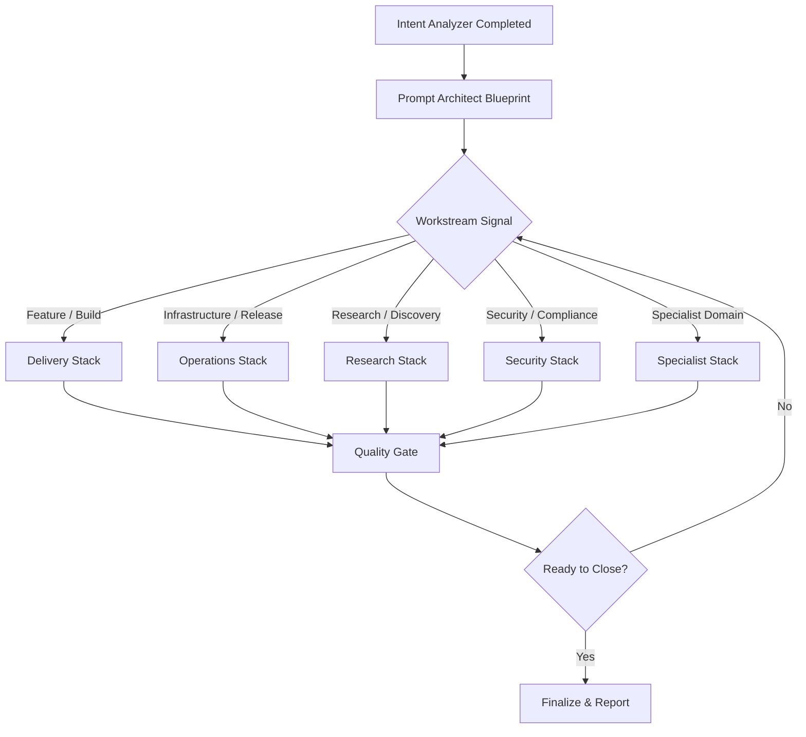

# Skills Playbook Decision Tree

## Purpose and Scope
This playbook sequences the skills under `skills/` into a reusable operating model. Every skill is treated as an SOP. The playbook describes when to activate each SOP, the order of activation, and how to branch into domain-specific stacks while maintaining coordination discipline.

The playbook relies on the canonical category breakdown so teams can quickly map problems to the right branch.【F:skills/README.md†L1-L47】

## Phase 0 – Intent Intake
1. **Run `research/intent-analyzer`** to excavate explicit and implicit goals, map probable interpretations, and surface missing constraints before any downstream work.【F:skills/research/intent-analyzer/skill.md†L1-L143】
2. Decide whether clarification is required. If confidence < 80%, ask targeted Socratic questions and restate the refined intent to the stakeholder.【F:skills/research/intent-analyzer/skill.md†L122-L189】

_Output_: an intent brief capturing the dominant interpretation, uncertainties, and success criteria.

## Phase 1 – Prompt Blueprint
1. **Activate `foundry/prompt-architect`** to transform the intent brief into an executable prompt blueprint: clarify the goal, organize instructions, add missing context, and wire in evidence-based prompting techniques.【F:skills/foundry/prompt-architect/skill.md†L1-L166】
2. Embed quality mechanisms (self-consistency, program-of-thought, plan-then-execute) to guard against downstream error propagation.【F:skills/foundry/prompt-architect/skill.md†L127-L199】

_Output_: a structured prompt package (instructions, constraints, output contract) ready for coordination.

## Phase 2 – Coordination & Action Graph
1. **Invoke `orchestration/coordination`** to translate the prompt package into an action graph. Choose topology (mesh vs. hierarchical vs. adaptive) based on agent count, dependency strength, and fault-tolerance needs.【F:skills/orchestration/coordination/skill.md†L1-L159】
2. Define consensus mechanisms (Byzantine vs. Raft) and execution mode (parallel, sequential, adaptive) to match the work profile.【F:skills/orchestration/coordination/skill.md†L90-L129】
3. Produce a coordination canvas: ordered actions, required artifacts, success gates, and fallback plans.

_Output_: agent-ready execution plan with topology, consensus policy, and subtask definitions.

## Phase 3 – Agent Assignment
1. Use the action graph to enumerate required capabilities (e.g., full-stack delivery, testing, research, security).
2. **Consult the Agent Registry** to select the smallest set of agents that covers those capabilities while respecting domain specialization and command availability.【F:docs/AGENT-REGISTRY.md†L1-L48】
3. For multi-agent swarms, align each subtask to a named agent role and document escalation paths.

_Output_: staffed swarm roster with explicit responsibilities and tool access.

## Phase 4 – Decision Tree Routing
The following mermaid diagram encodes the core routing logic from coordination to domain branches:

### Branch Playbooks
- **Delivery Stack** → `delivery/feature-dev-complete` for end-to-end feature shipping, optionally chaining `delivery/debugging` or `delivery/smart-bug-fix` for targeted fixes.【F:skills/delivery/feature-dev-complete/skill.md†L1-L160】
- **Operations Stack** → `operations/production-readiness` to enforce deployment gates (quality audit, security, performance, docs) before shipping.【F:skills/operations/production-readiness/skill.md†L1-L160】
- **Research Stack** → `research/deep-research-orchestrator` to run the three-phase research SOP with quality gates and artifact generation.【F:skills/research/deep-research-orchestrator/skill.md†L1-L120】
- **Security Stack** → `security/network-security-setup` to lock down environments, then layer additional security SOPs as required.【F:skills/security/network-security-setup/skill.md†L1-L120】
- **Specialist Stack** → `specialists/language-specialists` (or peers) when a domain expert is required for language- or platform-specific execution.【F:skills/specialists/language-specialists/skill.md†L1-L120】

Each branch inherits the coordination canvas and agent roster; the selected skill SOP runs as the core execution engine for that workstream.

## Phase 5 – Quality Gate Loop
1. After each branch completes, pass outputs through the quality gate stack. Start with `quality/code-review-assistant` (multi-agent PR review) and layer `quality/functionality-audit`, `quality/verification-quality`, or category-specific audits as needed.【F:skills/quality/code-review-assistant/skill.md†L1-L160】
2. If the gate fails, feed findings back into the coordination canvas. Update assignments or prompt blueprint, then re-run the relevant branch.

_Output_: quality report, pass/fail status, remediation backlog.

## Phase 6 – Closure & Reporting
1. If all gates pass, consolidate deliverables and status reports from the branch skill. Delivery and operations flows export deployment checklists and PR artifacts; research flows export reproducibility bundles; security flows log policy state.
2. Publish the final package and archive the coordination canvas for reuse.

This playbook enforces a consistent intake → prompt design → coordinated execution → quality gating loop, while allowing tailored domain SOPs to plug in where appropriate.
