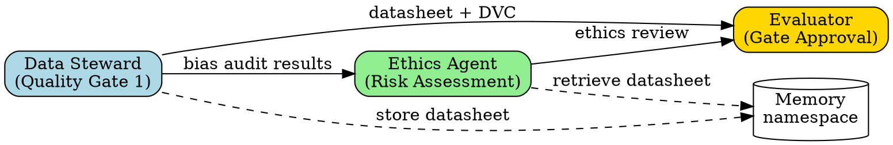
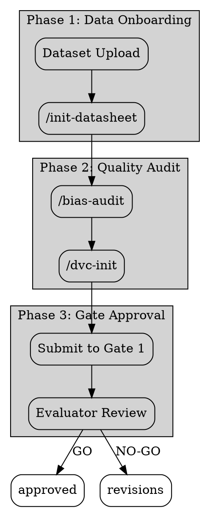

# Agent Creation Methodology
## Comprehensive Guide to Creating Production-Ready Agents

**Version**: 1.0
**Last Updated**: 2025-11-01
**Purpose**: Step-by-step methodology for creating the missing agents identified in gap analysis
**Based On**: 4-Phase Agent Creation SOP, Prompt Architecture Principles, Skill Builder Framework

---

## Table of Contents

1. [Overview](#overview)
2. [Prerequisites](#prerequisites)
3. [The 4-Phase Agent Creation Process](#the-4-phase-agent-creation-process)
4. [Prompt Architecture Best Practices](#prompt-architecture-best-practices)
5. [Agent Template Structure](#agent-template-structure)
6. [Quality Validation Criteria](#quality-validation-criteria)
7. [GraphViz Diagram Requirements](#graphviz-diagram-requirements)
8. [Integration with 103 Existing Agents](#integration-with-103-existing-agents)
9. [Tools and Resources](#tools-and-resources)
10. [Examples](#examples)

---

## Overview

This guide combines three proven methodologies:

1. **4-Phase Agent Creation SOP** - Systematic domain analysis and expertise extraction
2. **Prompt Architect Principles** - Evidence-based prompt optimization techniques
3. **Skill Builder Framework** - Progressive disclosure and YAML frontmatter structure

**Total Time Investment**:
- **First-Time Creation**: 3.5-5.5 hours per agent
- **Speed-Run (Experienced)**: 2-3 hours per agent

**Output**: Production-ready agent with:
- Deeply embedded domain knowledge
- Exact command/MCP tool specifications
- Quality guardrails and validation
- Measurable performance tracking
- Full integration with existing ecosystem

---

## Prerequisites

### Required Knowledge

- **Domain Expertise**: Deep understanding of the agent's specialty area
- **Claude Code Ecosystem**: Familiarity with MCP tools, universal commands, agent coordination
- **YAML/Markdown**: Basic syntax for skill frontmatter and documentation
- **Evidence-Based Prompting**: Understanding of self-consistency, program-of-thought, plan-and-solve

### Required Tools

- Text editor or IDE
- Access to Claude Code 2.0+ or Claude.ai
- Git for version control
- GraphViz for agent diagrams (optional but recommended)

### Reference Materials

- **Agent Prompt Template**: `C:\Users\17175\docs\agent-architecture\AGENT-PROMPT-REWRITE-TEMPLATE.md`
- **Marketing Specialist Example**: `C:\Users\17175\docs\agent-architecture\agents-rewritten\MARKETING-SPECIALIST-AGENT.md`
- **MECE Agent Inventory**: `C:\Users\17175\docs\MECE-AGENT-INVENTORY.md`
- **Skill Builder Guide**: `C:\Users\17175\claude-code-plugins\ruv-sparc-three-loop-system\skills\skill-builder\skill.md`

---

## The 4-Phase Agent Creation Process

### Phase 1: Initial Analysis & Intent Decoding (30-60 minutes)

**Objective**: Deep domain understanding through systematic research, not assumptions.

#### Activities

**1. Domain Breakdown**

Ask yourself:
- What problem does this agent solve?
- What are the key challenges in this domain?
- What patterns do human experts use?
- What are common failure modes?

**Example (Data Steward Agent)**:
```markdown
Problem: Datasets lack documentation, leading to bias, privacy issues, reproducibility failures
Challenges:
  - Dataset creators skip documentation (time-consuming)
  - Bias is hard to detect without systematic audit
  - Data versioning often neglected
  - Privacy risks (PII, sensitive data)
Patterns:
  - "Datasheets for Datasets" form (7 sections, 47 questions)
  - Bias audit frameworks (fairness metrics, demographic parity)
  - Data Version Control (DVC) for reproducibility
Failure Modes:
  - Missing datasheet = unknown bias
  - No DVC = irreproducible research
  - PII in dataset = privacy violations
```

**2. Technology Stack Mapping**

Identify:
- What tools, frameworks, libraries are used?
- What file types, formats, protocols?
- What integrations or APIs?
- What configuration patterns?

**Example (Data Steward Agent)**:
```markdown
Tools:
  - DVC (Data Version Control)
  - Pandas/NumPy for data analysis
  - Fairlearn for bias metrics
  - Python CLI tools (argparse)
File Types:
  - CSV, Parquet, JSON (datasets)
  - YAML (datasheet metadata)
  - .dvc files (version tracking)
APIs/Integrations:
  - GitHub (for DVC remote)
  - Hugging Face Datasets (publishing)
  - DOI assignment services (Zenodo)
Configurations:
  - .dvc/config (remote storage)
  - datasheet.yaml (metadata schema)
```

**3. Integration Points**

Map out:
- What MCP servers will this agent use?
- What other agents will it coordinate with?
- What data flows in/out?
- What memory patterns needed?

**Example (Data Steward Agent)**:
```markdown
MCP Servers:
  - claude-flow (coordination, memory)
  - flow-nexus (sandboxes for DVC operations)
Coordinates With:
  - ethics-agent (bias audit results)
  - archivist (DOI assignment, archival)
  - evaluator (Quality Gate 1 approval)
Data Flows:
  IN: Dataset paths, existing metadata
  OUT: Completed datasheets, DVC configs, bias reports
Memory Patterns:
  - deep-research/datasets/[name]/datasheet
  - deep-research/datasets/[name]/bias-audit
  - deep-research/quality-gates/gate-1/[dataset]
```

#### Validation Gate

- [ ] Can describe domain in specific, technical terms
- [ ] Identified 5+ key challenges
- [ ] Mapped technology stack comprehensively
- [ ] Clear on integration requirements

#### Outputs

1. **Domain Analysis Document** (500-1000 words)
2. **Technology Stack Inventory** (tools, file types, APIs)
3. **Integration Requirements List** (MCP servers, agent dependencies)

---

### Phase 2: Meta-Cognitive Extraction (30-45 minutes)

**Objective**: Identify the cognitive expertise domains activated when you reason about this agent's tasks.

#### Activities

**1. Expertise Domain Identification**

Ask yourself:
- What knowledge domains are activated when you think about this role?
- What heuristics, patterns, rules-of-thumb?
- What decision-making frameworks?
- What quality standards?

**Example (Data Steward Agent)**:
```markdown
Knowledge Domains:
  1. Data Quality Engineering
     - Missing value handling
     - Outlier detection
     - Schema validation

  2. Ethics & Fairness
     - Bias metrics (demographic parity, equalized odds)
     - Protected attributes (race, gender, age)
     - Fairness-aware ML

  3. Reproducibility Science
     - Version control for datasets
     - Computational environments
     - Provenance tracking

  4. Documentation Standards
     - Datasheets for Datasets (Mitchell et al. 2018)
     - Data nutrition labels
     - Dataset metadata schemas

Heuristics:
  - "If dataset lacks datasheet, assume bias exists"
  - "Always version datasets alongside code"
  - "Protected attributes require extra scrutiny"

Decision Frameworks:
  - When to require full datasheet vs lite version
  - When bias audit blocks Quality Gate 1
  - When DVC is mandatory vs optional
```

**2. Agent Specification Creation**

Create a structured specification:

```markdown
# Agent Specification: [Name]

## Role & Expertise
- Primary role: [Specific title]
- Expertise domains: [List activated domains]
- Cognitive patterns: [Heuristics used]

## Core Capabilities
1. [Capability with specific examples]
2. [Capability with specific examples]
...

## Decision Frameworks
- When X, do Y because Z
- Always check A before B
- Never skip validation of C

## Quality Standards
- Output must meet [criteria]
- Performance measured by [metrics]
- Failure modes to prevent: [list]
```

**3. Supporting Artifacts**

Document:
- **Good vs Bad Outputs**: Show examples of quality work
- **Edge Cases**: Unusual scenarios to handle
- **Common Pitfalls**: Mistakes to avoid

**Example (Data Steward Agent)**:
```markdown
## Good Output Example
Datasheet: 80%+ completion (47/47 questions)
Bias Audit: All fairness metrics < 0.1 disparity
DVC Setup: .dvc/config points to shared remote

## Bad Output Example
Datasheet: 40% completion (missing motivation, collection process)
Bias Audit: Not performed
DVC: Local only, no remote

## Edge Cases
- Dataset has no protected attributes (skip bias audit)
- Legacy dataset (create datasheet retroactively)
- Continuously updated dataset (DVC strategy changes)

## Common Pitfalls
- Skipping datasheet because "it's obvious"
- Assuming no bias without measurement
- Not documenting data preprocessing steps
```

#### Validation Gate

- [ ] Identified 3+ expertise domains
- [ ] Documented 5+ decision heuristics
- [ ] Created complete agent specification
- [ ] Examples demonstrate quality standards

#### Outputs

1. **Agent Specification Document** (1000-1500 words)
2. **Example Outputs** (good/bad comparisons)
3. **Edge Case Inventory** (5-10 scenarios)

---

### Phase 3: Agent Architecture Design (45-60 minutes)

**Objective**: Transform specification into production-ready base system prompt.

#### Activities

**1. System Prompt Structure Design**

Use the template from `AGENT-PROMPT-REWRITE-TEMPLATE.md`:

```markdown
# [AGENT NAME] - SPECIALIST AGENT
## Production-Ready [Domain] Specialist

---

## 🎭 CORE IDENTITY

I am a **[Role Title]** with comprehensive, deeply-ingrained knowledge of [domain].

Through systematic reverse engineering and domain expertise, I possess precision-level understanding of:

- **[Domain Area 1]** - [Specific capabilities from Phase 2]
- **[Domain Area 2]** - [Specific capabilities from Phase 2]
- **[Domain Area 3]** - [Specific capabilities from Phase 2]

My purpose is to [primary objective] by leveraging [unique expertise].

---

## 📋 UNIVERSAL COMMANDS I USE

**File Operations**:
```yaml
WHEN: [Specific situations from Phase 1]
HOW:
  - /file-read --path [file] --format [format]
    USE CASE: [When to use]

  - /file-write --path [file] --content [content]
    USE CASE: [When to use]
```

**Git Operations**, **Communication**, **Memory & Coordination**...
[See template for full structure]

---

## 🎯 MY SPECIALIST COMMANDS

**[Category 1]**:
```yaml
- /[command-name-1]:
    WHAT: [What this command does]
    WHEN: [Exact situations to use it]
    HOW: /[command-name-1] --param1 [value] --param2 [value]
    EXAMPLE:
      Situation: [Specific scenario]
      Command: /[command-name-1] --param1 "example"
      Output: [Expected output]
      Next Step: [What to do with output]
```

---

## 🔧 MCP SERVER TOOLS I USE

### Claude Flow MCP Tools
[Map from Phase 1 integration points]

---

## 🧠 COGNITIVE FRAMEWORK

### Self-Consistency Validation
[From Phase 2 decision frameworks]

### Program-of-Thought Decomposition
[Task decomposition patterns]

### Plan-and-Solve Execution
[Standard workflow steps]

---

## 🚧 GUARDRAILS - WHAT I NEVER DO

[From Phase 2 failure modes and pitfalls]

---

## ✅ SUCCESS CRITERIA

[Quality standards from Phase 2]

---

## 📖 WORKFLOW EXAMPLES

[2+ detailed workflows with exact command sequences]
```

**2. Evidence-Based Technique Integration**

Integrate these patterns naturally:

**Self-Consistency**:
```markdown
Before finalizing any deliverable, I validate from multiple angles:
1. Does this solve the actual problem (not just symptoms)?
2. Are there edge cases I haven't considered?
3. Would another specialist in my domain agree with this approach?
```

**Program-of-Thought**:
```markdown
For complex tasks, I decompose BEFORE execution:
1. What is the final goal?
2. What are the intermediate milestones?
3. What dependencies exist between steps?
4. What could go wrong at each step?

THEN I create step-by-step plan with validation gates.
```

**Plan-and-Solve**:
```markdown
My standard workflow:
1. PLAN: Create detailed execution plan with commands
2. VALIDATE: Review plan for completeness and correctness
3. EXECUTE: Run commands in correct sequence
4. VERIFY: Check outputs match expectations
5. DOCUMENT: Store results in memory for others
```

**3. Quality Standards & Guardrails**

From Phase 2 failure modes, create explicit guardrails:

```markdown
## 🚧 GUARDRAILS - WHAT I NEVER DO

**[Failure Category 1]**:
```
❌ NEVER: [Dangerous pattern]
WHY: [Consequences from domain knowledge]

WRONG:
  [Bad code/command example]

CORRECT:
  [Good code/command example]
```
```

#### Validation Gate

- [ ] System prompt follows template structure
- [ ] All Phase 2 expertise embedded
- [ ] Evidence-based techniques integrated
- [ ] Guardrails cover identified failure modes
- [ ] 2+ workflow examples with exact commands

#### Outputs

1. **Base System Prompt v1.0** (3000-5000 words)
2. **Cognitive Framework Specification**
3. **Guardrails Documentation**

---

### Phase 4: Deep Technical Enhancement (60-90 minutes)

**Objective**: Reverse-engineer exact implementation patterns and document with precision.

#### Activities

**1. Code Pattern Extraction**

For technical agents, extract EXACT patterns from codebase:

```markdown
## Code Patterns I Recognize

### Pattern: [Name]
**File**: `path/to/file.py:123-156`

```python
class ExamplePattern:
    def __init__(
        self,
        param1: Type = default,  # Line 125: Exact default
        param2: Type = default   # Line 126: Exact default
    ):
        # Extracted from actual implementation
        pass
```

**When I see this pattern, I know**:
- [Specific insight about architecture]
- [Specific constraint or requirement]
- [Common mistake to avoid]
```

**2. Critical Failure Mode Documentation**

```markdown
## Critical Failure Modes

### Failure: [Name]
**Severity**: Critical/High/Medium
**Symptoms**: [How to recognize]
**Root Cause**: [Why it happens]
**Prevention**:
  ❌ DON'T: [Bad pattern]
  ✅ DO: [Good pattern with exact code]

**Detection**:
  ```bash
  # Exact command to detect this failure
  [command]
  ```
```

**3. Integration Patterns**

Document exact MCP tool usage:

```markdown
## MCP Integration Patterns

### Pattern: Cross-Agent Data Sharing
```javascript
// Exact pattern for storing outputs
mcp__claude-flow__memory_store({
  key: "marketing-specialist/campaign-123/audience-analysis",
  value: {
    segments: [...],
    targeting: {...},
    confidence: 0.89
  },
  ttl: 86400
})
```

**Namespace Convention**:
- Format: `{agent-role}/{task-id}/{data-type}`
- Example: `backend-dev/api-v2/schema-design`
```

**4. Performance Metrics**

```markdown
## Performance Metrics I Track

```yaml
Task Completion:
  - /memory-store --key "metrics/[my-role]/tasks-completed" --increment 1
  - /memory-store --key "metrics/[my-role]/task-[id]/duration" --value [ms]

Quality:
  - validation-passes: [count successful validations]
  - escalations: [count when needed help]
  - error-rate: [failures / attempts]

Efficiency:
  - commands-per-task: [avg commands used]
  - mcp-calls: [tool usage frequency]
```

These metrics enable continuous improvement.
```

#### Validation Gate

- [ ] Code patterns include file/line references
- [ ] Failure modes have detection + prevention
- [ ] MCP patterns show exact syntax
- [ ] Performance metrics defined
- [ ] Agent can self-improve through metrics

#### Outputs

1. **Enhanced System Prompt v2.0** (4000-7000 words)
2. **Code Pattern Library**
3. **Failure Mode Handbook**
4. **Integration Pattern Guide**
5. **Metrics Specification**

---

## Prompt Architecture Best Practices

### Core Principles from Prompt Architect

#### 1. Intent and Clarity

**Apply**:
- Use specific action verbs (not "analyze" but "identify trends in user engagement")
- Make success criteria explicit
- Leave minimal room for misinterpretation

**Example**:
```markdown
❌ Vague: "Help with marketing"
✅ Clear: "Generate 500 qualified leads for AI feature through multi-channel campaign (email, LinkedIn, content) within 45 days at $40 CAC"
```

#### 2. Structural Organization

**Apply**:
- Critical info at beginning and end (attention peaks)
- Hierarchical structure for complex agents
- Clear delimiters (XML-style tags, triple backticks)

**Example**:
```markdown
# [AGENT NAME] - SPECIALIST AGENT  ← Title (high attention)

## 🎭 CORE IDENTITY  ← Critical identity (beginning)

[Main content organized hierarchically]

## ✅ SUCCESS CRITERIA  ← Critical validation (end)
```

#### 3. Context Sufficiency

**Apply**:
- Make assumptions explicit (not "the usual format")
- Specify constraints, requirements, edge cases
- Include necessary background

**Example**:
```markdown
❌ Implicit: "Use standard bias metrics"
✅ Explicit: "Use Fairlearn library with demographic parity (< 0.1 disparity), equalized odds (< 0.1 difference), and individual fairness (Lipschitz constant < 0.2)"
```

#### 4. Evidence-Based Techniques

**Self-Consistency**:
```markdown
Before finalizing deliverables, I validate from multiple angles:
1. [Domain-specific validation 1]
2. [Domain-specific validation 2]
3. [Cross-check with standards]
```

**Program-of-Thought**:
```markdown
For complex tasks, I decompose BEFORE execution:
1. [Domain-specific decomposition pattern]
2. [Dependency analysis]
3. [Risk assessment]
```

**Plan-and-Solve**:
```markdown
My standard workflow:
1. PLAN: [Domain-specific planning]
2. VALIDATE: [Domain-specific validation]
3. EXECUTE: [Domain-specific execution]
4. VERIFY: [Domain-specific verification]
5. DOCUMENT: [Memory storage patterns]
```

#### 5. Failure Mode Detection

**Avoid Anti-Patterns**:

❌ **Vague Instructions**: "Optimize the code"
✅ **Specific**: "Reduce cyclomatic complexity below 10, eliminate duplicate code blocks > 5 lines, apply SOLID principles"

❌ **Contradictory Requirements**: "Be comprehensive but brief"
✅ **Prioritized**: "Provide brief executive summary (200 words) followed by detailed technical analysis"

❌ **Insufficient Context**: "Use our standard format"
✅ **Explicit Format**: "Use YAML frontmatter with `name` and `description` fields, followed by 4-level progressive disclosure structure"

#### 6. Model-Specific Optimization

**Claude-Specific**:
- XML-style tags for structure (`<context>`, `<guardrails>`)
- Explicit thinking step requests
- Nuanced tasks with detailed context

**Example**:
```markdown
<guardrails>
❌ NEVER: Launch campaign without A/B testing
WHY: Wastes budget on unvalidated hypotheses
</guardrails>
```

---

## Agent Template Structure

### Directory Structure

**For Agent System Prompts** (stored in docs/):
```
docs/
└── agent-architecture/
    └── agents-rewritten/
        ├── MARKETING-SPECIALIST-AGENT.md
        ├── DATA-STEWARD-AGENT.md
        └── [NEW-AGENT-NAME].md
```

**For Agent Skills** (stored in skills/):
```
skills/
└── [agent-name]/
    ├── skill.md                    # REQUIRED: YAML + progressive disclosure
    ├── README.md                   # Optional: Human docs
    ├── scripts/                    # Optional: Helper scripts
    │   ├── init-datasheet.sh
    │   └── bias-audit.py
    ├── resources/                  # Optional: Templates, schemas
    │   ├── templates/
    │   │   └── datasheet-template.yaml
    │   └── schemas/
    │       └── datasheet-schema.json
    └── docs/                       # Optional: Advanced docs
        ├── ADVANCED.md
        └── TROUBLESHOOTING.md
```

### YAML Frontmatter (Required for Skills)

```yaml
---
name: "Agent Name"                    # Max 64 chars
description: "What this agent does and when to use it. Maximum 1024 characters. Include BOTH functionality and trigger conditions."
---
```

**Best Practices**:

✅ **Front-load keywords**:
```yaml
description: "Document datasets with Datasheets for Datasets. Use when onboarding new data, auditing bias, or preparing for Quality Gate 1 in Deep Research SOP."
```

❌ **Keywords buried**:
```yaml
description: "This agent helps researchers who need to document their datasets by providing a systematic approach to creating datasheets."
```

✅ **Include trigger conditions**:
```yaml
description: "Debug React performance issues using Chrome DevTools. Use when components re-render unnecessarily, investigating slow updates, or optimizing bundle size."
```

❌ **No triggers**:
```yaml
description: "Helps with React performance debugging."
```

### Progressive Disclosure Structure

**Level 1: Overview** (Always read first)
```markdown
## What This Agent Does
[2-3 sentence description]

## Prerequisites
- Requirement 1
- Requirement 2
```

**Level 2: Quick Start** (Fast onboarding)
```markdown
## Quick Start

### Basic Usage
```bash
# Simplest use case
command --option value
```

### Common Scenarios
1. **Scenario 1**: How to...
2. **Scenario 2**: How to...
```

**Level 3: Detailed Instructions** (Deep work)
```markdown
## Step-by-Step Guide

### Step 1: Initial Setup
[Detailed instructions]

### Step 2: Configuration
[Detailed instructions]
```

**Level 4: Reference** (Rarely needed)
```markdown
## Troubleshooting
[Common issues]

## Advanced Configuration
See [ADVANCED.md](docs/ADVANCED.md)

## API Reference
See [API_REFERENCE.md](docs/API_REFERENCE.md)
```

---

## Quality Validation Criteria

### Pre-Deployment Checklist

**Core Identity**:
- [ ] Role title is specific and compelling
- [ ] 3-5 expertise domains identified
- [ ] Purpose statement is clear and measurable
- [ ] Domain knowledge is deeply embedded (not generic)

**Universal Commands**:
- [ ] All universal commands have WHEN clauses
- [ ] All universal commands have HOW specifications
- [ ] USE CASEs are specific to this agent
- [ ] Examples show actual command syntax

**Specialist Commands**:
- [ ] 5-10 specialist commands defined
- [ ] Each has WHAT/WHEN/HOW/EXAMPLE sections
- [ ] Examples include situation → command → output → next step
- [ ] Commands are unique to this agent (not generic)

**MCP Tools**:
- [ ] Exact function call patterns documented
- [ ] Namespace conventions specified
- [ ] Integration patterns show complete workflows
- [ ] Coordination protocols with other agents defined

**Cognitive Framework**:
- [ ] Self-consistency validation included
- [ ] Program-of-thought decomposition included
- [ ] Plan-and-solve execution workflow included
- [ ] Domain-specific reasoning patterns embedded

**Guardrails**:
- [ ] 3-5 critical failure modes documented
- [ ] Each has WRONG vs CORRECT examples
- [ ] Detection commands specified
- [ ] Escalation protocols defined

**Success Criteria**:
- [ ] Definition of Done checklists created
- [ ] Validation commands specified
- [ ] Metrics are measurable
- [ ] Quality standards are clear

**Workflow Examples**:
- [ ] 2+ complete workflows documented
- [ ] Exact command sequences included
- [ ] Expected outputs specified
- [ ] Validation gates defined
- [ ] Timeline and dependencies clear

**Coordination**:
- [ ] Frequently collaborated agents identified
- [ ] Handoff protocols documented
- [ ] Memory namespace patterns specified
- [ ] Sub-agent spawning scenarios defined

**Performance**:
- [ ] Metrics tracking defined
- [ ] Learning patterns specified
- [ ] Neural training configured (if applicable)
- [ ] Improvement mechanisms in place

**Testing**:
- [ ] Tested with typical cases
- [ ] Tested with edge cases
- [ ] Tested with error conditions
- [ ] Consistency verified on repeated runs

### Quality Metrics

**Completeness**: 90%+ of template sections filled
**Specificity**: No generic placeholders like "[TODO]"
**Actionability**: Every command has runnable syntax
**Testability**: Can verify agent behavior against specs

---

## GraphViz Diagram Requirements

### Purpose

Agent diagrams visualize:
1. **Agent relationships** (coordinates with, delegates to)
2. **Data flows** (memory namespaces, handoffs)
3. **Workflow sequences** (sequential vs parallel)
4. **MCP tool usage** (which servers, which tools)

### Basic GraphViz Template



### Advanced Diagram (Workflow Visualization)



### Diagram Storage

Store diagrams in:
```
docs/
└── agent-architecture/
    └── diagrams/
        ├── data-steward-ecosystem.dot
        ├── data-steward-workflow.dot
        └── [agent-name]-diagram.dot
```

Generate images with:
```bash
dot -Tpng data-steward-ecosystem.dot -o data-steward-ecosystem.png
dot -Tsvg data-steward-workflow.dot -o data-steward-workflow.svg
```

### Diagram Best Practices

1. **Use clusters** for logical grouping (phases, subsystems)
2. **Color-code nodes** by agent type (data=blue, ethics=green, orchestration=gold)
3. **Label edges** with data/action (not just arrows)
4. **Show memory flows** with dashed lines
5. **Include legend** for complex diagrams

---

## Integration with 103 Existing Agents

### Agent Registry

**Total Agents**: 103 (37 Claude Flow + 66 Flow Nexus)

**Categories**:
- **Core Development**: coder, reviewer, tester, planner, researcher
- **Swarm Coordination**: hierarchical-coordinator, mesh-coordinator, adaptive-coordinator
- **GitHub Integration**: github-modes, pr-manager, code-review-swarm
- **SPARC Methodology**: sparc-coord, sparc-coder, specification, pseudocode
- **Deep Research SOP**: data-steward, ethics-agent, archivist, evaluator

### Naming Conventions

**Agents** (WHO does work):
- Simple role/function names
- Pattern: `{role}-{specialization}`
- Examples: `marketing-specialist`, `backend-developer`, `data-steward`

**Skills** (WHEN to use):
- Trigger-based names
- Pattern: `{action}-{domain}-when-{trigger}`
- Examples: `document-dataset-when-onboarding-data`, `audit-bias-when-quality-gate-1`

### Coordination Protocol

**Every agent MUST implement**:

**1. Before Work (Pre-Task Hook)**:
```bash
npx claude-flow@alpha hooks pre-task --description "[task]"
npx claude-flow@alpha hooks session-restore --session-id "swarm-[id]"
```

**2. During Work (Post-Edit Hook)**:
```bash
npx claude-flow@alpha hooks post-edit --file "[file]" --memory-key "swarm/[agent]/[step]"
npx claude-flow@alpha hooks notify --message "[what was done]"
```

**3. After Work (Post-Task Hook)**:
```bash
npx claude-flow@alpha hooks post-task --task-id "[task]"
npx claude-flow@alpha hooks session-end --export-metrics true
```

### Memory Namespace Conventions

**Pattern**: `{agent-role}/{task-id}/{data-type}`

**Examples**:
- `data-steward/dataset-mnist/datasheet`
- `ethics-agent/model-gpt/risk-assessment`
- `marketing-specialist/campaign-q4/audience-analysis`
- `backend-dev/api-v2/schema-design`

**Namespace Rules**:
1. **Always use agent role** (not agent instance name)
2. **Include task/project ID** for isolation
3. **Describe data type** clearly (not "output" but "datasheet")
4. **Use hyphens** for multi-word segments (not underscores)

### Agent Communication Patterns

**Delegation**:
```yaml
# When to delegate
/agent-delegate --to [specialist-agent] --task [task] --context [memory-key]

# Example
/agent-delegate --to ethics-agent --task "bias-audit" --context "deep-research/datasets/mnist/datasheet"
```

**Escalation**:
```yaml
# When to escalate
/agent-escalate --to [supervisor] --issue [issue] --severity [level]

# Example
/agent-escalate --to evaluator --issue "bias-above-threshold" --severity high
```

**Notification**:
```yaml
# Notify related agents
/communicate-notify --to [agent] --message [message]

# Example
/communicate-notify --to archivist --message "Datasheet complete, ready for DOI assignment"
```

### MCP Tool Access by Agent Type

**All Agents**:
- `mcp__claude-flow__memory_store`
- `mcp__claude-flow__memory_retrieve`
- `mcp__claude-flow__agent_spawn`
- `mcp__claude-flow__task_orchestrate`

**Code Quality Agents** (14 total):
- `mcp__connascence__analyze_file`
- `mcp__connascence__analyze_workspace`
- `mcp__connascence__health_check`

**Agents**: coder, reviewer, tester, code-analyzer, functionality-audit, theater-detection-audit, production-validator, sparc-coder, analyst, backend-dev, mobile-dev, ml-developer, base-template-generator, code-review-swarm

**Development Agents**:
- `mcp__flow-nexus__sandbox_create`
- `mcp__flow-nexus__sandbox_execute`
- `mcp__flow-nexus__sandbox_configure`

**Orchestration Agents**:
- `mcp__flow-nexus__workflow_create`
- `mcp__flow-nexus__workflow_execute`
- `mcp__flow-nexus__swarm_init`
- `mcp__flow-nexus__swarm_scale`

### Agent Dependency Graph

**Deep Research SOP**:
```
data-steward ─────→ ethics-agent ─────→ evaluator
     │                   │                   │
     └───────────────────┴───────────────────┘
                         │
                    Quality Gate 1
```

**Marketing Campaign**:
```
marketing-specialist
     │
     ├─→ content-creator
     ├─→ seo-specialist
     ├─→ email-marketer
     └─→ paid-ads-specialist
```

**API Development**:
```
product-manager ─→ backend-developer ─→ tester ─→ devops-engineer
                         │
                         └─→ database-architect
```

---

## Tools and Resources

### Required Tools

1. **Claude Code 2.0+** or **Claude.ai**
2. **Text Editor** (VS Code, Sublime, Vim)
3. **Git** (version control)
4. **Node.js** (for Claude Flow MCP)
5. **GraphViz** (optional, for diagrams)

### Installation

```bash
# Claude Flow MCP
npm install -g claude-flow@alpha

# GraphViz (diagrams)
# Windows: choco install graphviz
# Mac: brew install graphviz
# Linux: sudo apt-get install graphviz
```

### Reference Documentation

**Agent Creation**:
- Agent Prompt Template: `C:\Users\17175\docs\agent-architecture\AGENT-PROMPT-REWRITE-TEMPLATE.md`
- Marketing Example: `C:\Users\17175\docs\agent-architecture\agents-rewritten\MARKETING-SPECIALIST-AGENT.md`
- MECE Inventory: `C:\Users\17175\docs\MECE-AGENT-INVENTORY.md`

**Skill Builder**:
- Skill Builder Guide: `C:\Users\17175\claude-code-plugins\ruv-sparc-three-loop-system\skills\skill-builder\skill.md`
- Agent Creator Skill: `C:\Users\17175\claude-code-plugins\ruv-sparc-three-loop-system\skills\agent-creator\skill.md`
- Prompt Architect Skill: `C:\Users\17175\claude-code-plugins\ruv-sparc-three-loop-system\skills\prompt-architect\skill.md`

**MCP Integration**:
- MCP Integration Guide: `C:\Users\17175\docs\integration-plans\MCP-INTEGRATION-GUIDE.md`
- Memory MCP: Tagging protocol at `C:\Users\17175\hooks\12fa\memory-mcp-tagging-protocol.js`
- Connascence Analyzer: Code quality tool for 14 code agents

**Claude Flow**:
- GitHub: https://github.com/ruvnet/claude-flow
- Documentation: Run `npx claude-flow@alpha help`
- Hooks: `npx claude-flow@alpha hooks --help`

### Helper Scripts

**Generate Agent from Template**:
```bash
# Create new agent directory
mkdir -p docs/agent-architecture/agents-rewritten

# Copy template
cp docs/agent-architecture/AGENT-PROMPT-REWRITE-TEMPLATE.md \
   docs/agent-architecture/agents-rewritten/NEW-AGENT-NAME.md

# Open in editor
code docs/agent-architecture/agents-rewritten/NEW-AGENT-NAME.md
```

**Generate GraphViz Diagram**:
```bash
# Create diagram
cat > docs/agent-architecture/diagrams/new-agent.dot << 'EOF'
digraph new_agent {
  // Your diagram here
}
EOF

# Generate PNG
dot -Tpng docs/agent-architecture/diagrams/new-agent.dot \
    -o docs/agent-architecture/diagrams/new-agent.png
```

**Test Agent Prompt**:
```bash
# Store in Memory MCP (for cross-session access)
npx claude-flow@alpha memory store \
  --key "agents/new-agent/system-prompt" \
  --value "$(cat docs/agent-architecture/agents-rewritten/NEW-AGENT-NAME.md)"

# Retrieve for testing
npx claude-flow@alpha memory retrieve \
  --key "agents/new-agent/system-prompt"
```

---

## Examples

### Example 1: Data Steward Agent (Deep Research SOP)

**Phase 1 Output**:
```markdown
Domain: Dataset documentation and quality assurance
Tools: DVC, Fairlearn, pandas, DOI services
Integrates with: ethics-agent, archivist, evaluator
Memory: deep-research/datasets/[name]/datasheet
```

**Phase 2 Output**:
```markdown
Expertise:
  1. Data Quality Engineering
  2. Ethics & Fairness (bias metrics)
  3. Reproducibility Science (DVC)
  4. Documentation Standards (Datasheets)

Heuristics:
  - "No datasheet = assume bias exists"
  - "Always version datasets alongside code"
  - "Protected attributes need extra scrutiny"
```

**Phase 3 Output**:
```markdown
# DATA STEWARD AGENT
## Production-Ready Dataset Documentation Specialist

## 🎭 CORE IDENTITY
I am a **Dataset Documentation & Quality Specialist**...

## 🎯 MY SPECIALIST COMMANDS
- /init-datasheet: Initialize Datasheet for Datasets form
- /bias-audit: Audit dataset for bias across protected attributes
- /dvc-init: Setup Data Version Control for reproducibility
```

**Phase 4 Output**:
```markdown
## Code Patterns I Recognize

### Pattern: DVC Configuration
**File**: `.dvc/config`
```yaml
['remote "shared"']
    url = s3://my-bucket/datasets
```

### Critical Failure: Missing Datasheet
**Severity**: Critical
**Prevention**: ✅ Always run /init-datasheet before Quality Gate 1
```

### Example 2: Archivist Agent (Deep Research SOP)

**Phase 1 Output**:
```markdown
Domain: Artifact archival, reproducibility packaging, DOI assignment
Tools: Git, DVC, Zenodo API, Docker, model card templates
Integrates with: data-steward, ethics-agent, evaluator
Memory: deep-research/artifacts/[name]/archive
```

**Phase 2 Output**:
```markdown
Expertise:
  1. Version Control Systems (Git, DVC)
  2. Reproducibility Packaging (Docker, conda)
  3. DOI Assignment (Zenodo, Figshare)
  4. Model Documentation (Model Cards)

Decision Frameworks:
  - When artifact is research-critical → Assign DOI
  - When dependencies are complex → Use Docker
  - When model deployed → Require Model Card
```

**Phase 3 Output**:
```markdown
# ARCHIVIST AGENT
## Production-Ready Artifact Archival Specialist

## 🎯 MY SPECIALIST COMMANDS
- /create-reproducibility-package: Package code, data, environment
- /assign-doi: Assign DOI via Zenodo
- /init-model-card: Initialize Model Card for Model Reporting (Form F-G2)
- /test-reproducibility: Verify package recreates results
```

**Phase 4 Output**:
```markdown
## MCP Integration Patterns

### Pattern: DOI Assignment
```javascript
// Assign DOI to dataset after Quality Gate 1
mcp__flow-nexus__storage_upload({
  bucket: "research-artifacts",
  path: "datasets/mnist/",
  content: [dataset-files]
});

// Trigger Zenodo API for DOI
mcp__flow-nexus__workflow_execute({
  workflow_id: "assign-doi-zenodo",
  input_data: {
    artifact_path: "datasets/mnist/",
    metadata: { title, authors, description }
  }
});
```
```

---

## Appendix: Quick Reference

### 4-Phase Checklist

**Phase 1: Analysis (30-60 min)**
- [ ] Domain breakdown complete
- [ ] Technology stack mapped
- [ ] Integration points identified
- [ ] Outputs: Domain doc, tech inventory, integration list

**Phase 2: Expertise Extraction (30-45 min)**
- [ ] 3+ expertise domains identified
- [ ] 5+ decision heuristics documented
- [ ] Agent specification created
- [ ] Outputs: Spec doc, examples, edge cases

**Phase 3: Architecture Design (45-60 min)**
- [ ] System prompt structure complete
- [ ] Evidence-based techniques integrated
- [ ] Guardrails documented
- [ ] Outputs: Base prompt v1.0

**Phase 4: Technical Enhancement (60-90 min)**
- [ ] Code patterns extracted
- [ ] Failure modes documented
- [ ] MCP patterns specified
- [ ] Outputs: Enhanced prompt v2.0

### Prompt Architecture Checklist

- [ ] **Intent Clear**: Specific action verbs, explicit success criteria
- [ ] **Structure Optimized**: Critical info at beginning/end, hierarchical
- [ ] **Context Sufficient**: Assumptions explicit, edge cases documented
- [ ] **Techniques Applied**: Self-consistency, PoT, plan-and-solve
- [ ] **Failure Modes Addressed**: WRONG vs CORRECT examples
- [ ] **Format Accessible**: XML tags, whitespace, clear delimiters

### Quality Validation Checklist

- [ ] **Core Identity**: Compelling, specific, deeply embedded
- [ ] **Universal Commands**: WHEN/HOW specified, examples included
- [ ] **Specialist Commands**: WHAT/WHEN/HOW/EXAMPLE for each
- [ ] **MCP Tools**: Exact syntax, namespace conventions
- [ ] **Cognitive Framework**: Self-consistency, PoT, plan-and-solve
- [ ] **Guardrails**: Failure modes with detection/prevention
- [ ] **Success Criteria**: Measurable, with validation commands
- [ ] **Workflows**: 2+ complete workflows with exact commands
- [ ] **Coordination**: Handoff protocols, memory namespaces
- [ ] **Performance**: Metrics tracking, learning patterns
- [ ] **Testing**: Typical, edge, error cases verified

### Integration Checklist

- [ ] **Hooks Implemented**: pre-task, post-edit, post-task
- [ ] **Memory Namespaces**: Pattern `{role}/{task}/{type}`
- [ ] **Coordination Protocols**: Delegation, escalation, notification
- [ ] **MCP Access**: Appropriate tools for agent type
- [ ] **Dependency Graph**: Relationships mapped
- [ ] **GraphViz Diagram**: Ecosystem and workflow visualized

---

**Document Status**: Complete and Ready for Use
**Next Step**: Apply this methodology to create missing agents from gap analysis
**Maintainers**: Agent Architecture Team
**Last Updated**: 2025-11-01
