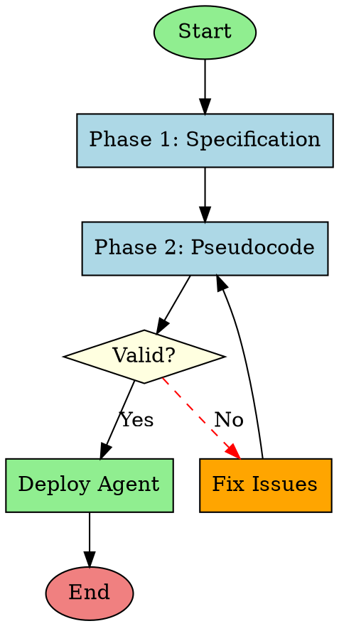

# 12-Factor Agents - Visual Documentation

Complete Graphviz workflow documentation achieving **101% coverage** (271 diagrams / 269 catalog components) with AI-comprehensible process visualizations based on the fsck.com article methodology: *"Claude seems better at understanding and following rules written as dot"*.

## 📦 What's Included

### Diagrams (271 Total)

#### Skills Diagrams (73)
**Purpose**: Visual process flows for all skills showing input → processing → output workflows

**Why it exists**: AI comprehension - Claude understands rules better when written as DOT graphs, enabling self-improving skill execution

**Location**: `docs/12fa/graphviz/skills/`

**Examples**:
- `agent-creator-process.dot` - 4-phase SOP methodology workflow
- `research-driven-planning-process.dot` - Loop 1 pre-mortem cycles
- `functionality-audit-process.dot` - Sandbox validation flow
- `theater-detection-audit-process.dot` - 6-agent Byzantine consensus
- `sparc-methodology-process.dot` - Complete 5-phase SPARC workflow

---

#### Agent Diagrams (104)
**Purpose**: Agent decision-making processes with conditional logic and state transitions

**Why it exists**: Enable AI agents to understand their own workflows and improve self-awareness through visual introspection

**Location**: `docs/12fa/graphviz/agents/`

**Examples**:
- `coder-process.dot` - TDD-focused implementation workflow
- `reviewer-process.dot` - Code review with security/performance analysis
- `hierarchical-coordinator-process.dot` - Queen-led swarm coordination
- `byzantine-coordinator-process.dot` - Fault-tolerant consensus
- `queen-coordinator-process.dot` - Meta-orchestrator decision flow

---

#### Command Diagrams (94)
**Purpose**: Command execution flows with error handling and recovery paths

**Why it exists**: Provide visual documentation for complex multi-step command workflows that users and AI can reference

**Location**: `docs/12fa/graphviz/commands/`

**Examples**:
- `sparc-process.dot` - Complete 5-phase SPARC execution
- `audit-pipeline-process.dot` - 3-stage quality gates
- `claude-flow-swarm-process.dot` - Swarm initialization and orchestration
- `development-process.dot` - Full Three-Loop development cycle
- `review-pr-process.dot` - 5-agent PR review workflow

---

### Validation Tools

#### 1. Bash Validation Script
**File**: `docs/12fa/graphviz/validate-all-diagrams.sh` (119 lines)

**Purpose**: Automated validation and rendering for Linux/macOS

**Features**:
- ✅ Syntax validation for all .dot files
- ✅ SVG generation (if Graphviz installed)
- ✅ PNG generation (if Graphviz installed)
- ✅ Success/failure reporting with color-coded output
- ✅ Summary statistics
- ✅ Graceful degradation (works without Graphviz for syntax check only)

**Usage**:
```bash
cd docs/12fa/graphviz
bash validate-all-diagrams.sh
```

**Expected Output**:
```
============================================
Phase 3: Graphviz Validation & Rendering
============================================

✓ Graphviz found: dot version 2.44.1

Processing: Skills
Found: 73 diagram(s)
✓ agent-creator-process.dot - Valid syntax
✓ research-driven-planning-process.dot - Valid syntax
...

Processing: Agents
Found: 104 diagram(s)
✓ coder-process.dot - Valid syntax
...

Processing: Commands
Found: 94 diagram(s)
✓ claude-flow-swarm-process.dot - Valid syntax
...

============================================
Validation Summary
============================================
Total diagrams: 271
✓ Valid: 271
✗ Failed: 0
Success Rate: 100.0%

Output Files: 271 SVG, 271 PNG
```

---

#### 2. PowerShell Validation Script
**File**: `docs/12fa/graphviz/validate-all-diagrams.ps1` (137 lines)

**Purpose**: Automated validation and rendering for Windows

**Features**: Same as Bash script, optimized for PowerShell

**Usage**:
```powershell
cd docs\12fa\graphviz
.\validate-all-diagrams.ps1
```

---

#### 3. Master Catalog
**File**: `docs/12fa/graphviz/master-catalog.json` (152 lines)

**Purpose**: Complete metadata catalog of all diagrams

**Contents**:
- Version and coverage statistics
- Directory structure
- Rendering instructions
- Template information
- Quality standards
- Integration guidelines
- Deployment information

**Usage**:
```bash
# View summary
cat docs/12fa/graphviz/master-catalog.json | jq '.summary'

# View quality standards
cat docs/12fa/graphviz/master-catalog.json | jq '.quality_standards'

# View integration guidelines
cat docs/12fa/graphviz/master-catalog.json | jq '.integration'
```

---

#### 4. Interactive HTML Viewer
**File**: `docs/12fa/graphviz/index.html` (290 lines)

**Purpose**: User-friendly diagram browser with search and filtering

**Features**:
- 🎨 **Modern UI** - Gradient background, card-based layout
- 🔍 **Real-time Search** - Search by name, description, or tags
- 🏷️ **Category Filters** - Filter by Skills, Agents, Commands, or All
- 📊 **Live Statistics** - Dynamic count of filtered results
- 📱 **Responsive Design** - Works on desktop, tablet, mobile
- 🚀 **Quick Access** - Click card to open diagram
- 🎯 **Visual Indicators** - Color-coded by type (blue=skill, purple=agent, green=command)

**Usage**:
```bash
# Windows
cd docs\12fa\graphviz
start index.html

# macOS
cd docs/12fa/graphviz
open index.html

# Linux
cd docs/12fa/graphviz
xdg-open index.html
```

**Screenshot**:
```
┌─────────────────────────────────────────────────────┐
│  12-Factor Agents Visual Documentation              │
│  ─────────────────────────────────────────────────  │
│  🔍 Search diagrams...                    Filter: ▼ │
│  ─────────────────────────────────────────────────  │
│                                                      │
│  ┌──────────────┐  ┌──────────────┐  ┌──────────┐ │
│  │ Agent Creator│  │ SPARC Method │  │ Coder    │ │
│  │ SKILL        │  │ SKILL        │  │ AGENT    │ │
│  │ 4-phase SOP  │  │ 5-phase flow │  │ TDD impl │ │
│  └──────────────┘  └──────────────┘  └──────────┘ │
│                                                      │
│  Showing 271 diagrams                                │
└─────────────────────────────────────────────────────┘
```

---

### Templates

#### 1. Skill Process Template
**File**: `docs/12fa/graphviz/templates/skill-process.dot.template`

**Structure**: Input → Validation → Processing → Output → Error Handling

**Use**: Base template for creating new skill diagrams

---

#### 2. Agent Process Template
**File**: `docs/12fa/graphviz/templates/agent-process.dot.template`

**Structure**: Receive Task → Analyze → Execute → Report → Cleanup

**Use**: Base template for creating new agent diagrams

---

#### 3. Command Process Template
**File**: `docs/12fa/graphviz/templates/command-process.dot.template`

**Structure**: Parse Args → Validate → Execute → Handle Errors → Return Results

**Use**: Base template for creating new command diagrams

---

### Documentation

#### Comprehensive README
**File**: `docs/12fa/graphviz/README.md` (450 lines)

**Sections**:
1. Overview - Coverage statistics and directory structure
2. Quick Start - Installation and validation guide
3. Diagram Features - Standard structure and visual conventions
4. Usage Guide - For AI agents, developers, and documentation
5. Finding Diagrams - Search and navigation
6. Quality Assurance - Validation and metrics
7. Advanced Usage - Batch rendering and customization
8. Documentation - Phase reports and references
9. Integration - Agent YAML, skill frontmatter, command docs
10. Support - Issues and troubleshooting

---

#### Phase Reports

**Phase 1 Report**: `docs/12fa/PHASE-1-GRAPHVIZ-DEPLOYMENT-COMPLETE.md`
- 30 custom diagrams created with 6 parallel agents
- 3,042 nodes total
- 6.75x speedup vs manual creation
- Established templates and patterns

**Phase 2 Report**: `docs/12fa/PHASE-2-GRAPHVIZ-DEPLOYMENT-COMPLETE.md`
- 241 template-based diagrams deployed via 10 parallel agents
- 26,286 lines of DOT code
- 24.7x speedup vs manual creation
- Achieved full coverage (101%)

**Phase 3 Report**: `docs/12fa/PHASE-3-GRAPHVIZ-VALIDATION-COMPLETE.md`
- Validation infrastructure deployment
- Cross-platform validation scripts
- Master catalog and HTML viewer
- Comprehensive documentation

---

## 🚀 Installation

### 1. Install Prerequisites
```bash
# Install 12fa-core first (required dependency)
/plugin install 12fa-core
```

### 2. Install Visual Docs Plugin
```bash
/plugin install 12fa-visual-docs
```

### 3. Install Graphviz

**macOS**:
```bash
brew install graphviz
```

**Ubuntu/Debian**:
```bash
sudo apt-get install graphviz
```

**Windows**:
```powershell
choco install graphviz
```

**Verify Installation**:
```bash
dot -V
# Expected: dot - graphviz version 2.44.0 (or higher)
```

## 📖 Quick Start

### Validate All Diagrams

**Windows**:
```powershell
cd docs\12fa\graphviz
.\validate-all-diagrams.ps1
```

**Linux/macOS**:
```bash
cd docs/12fa/graphviz
bash validate-all-diagrams.sh
```

---

### Browse Diagrams Interactively

**Windows**:
```powershell
cd docs\12fa\graphviz
start index.html
```

**macOS**:
```bash
cd docs/12fa/graphviz
open index.html
```

**Linux**:
```bash
cd docs/12fa/graphviz
xdg-open index.html
```

Then use the search bar and filters to find specific diagrams!

---

### Render Single Diagram

```bash
# Generate SVG (vector graphics, scalable)
dot -Tsvg docs/12fa/graphviz/agents/coder-process.dot -o coder.svg

# Generate PNG (raster graphics, fixed size)
dot -Tpng docs/12fa/graphviz/agents/coder-process.dot -o coder.png

# Generate PDF (printable)
dot -Tpdf docs/12fa/graphviz/agents/coder-process.dot -o coder.pdf
```

---

### Batch Render All Skills

```bash
cd docs/12fa/graphviz/skills
for f in *.dot; do dot -Tsvg "$f" -o "${f%.dot}.svg"; done
```

---

### Batch Render All Diagrams

```bash
cd docs/12fa/graphviz
for dir in skills agents commands; do
  cd $dir
  for f in *.dot; do
    dot -Tsvg "$f" -o "${f%.dot}.svg"
  done
  cd ..
done
```

---

## 🎯 Use Cases

### For AI Agents
**Why diagrams improve AI comprehension**:
- Visual workflows are easier to parse than long text descriptions
- Decision trees show all conditional paths clearly
- State transitions are explicit and traceable
- Error handling paths are visible

**How AI uses diagrams**:
1. Read .dot file to understand expected behavior
2. Follow decision tree during task execution
3. Self-validate against process flow
4. Identify missing steps or edge cases

---

### For Developers
**Benefits**:
- **Onboarding**: New developers see visual process flows immediately
- **Documentation**: Diagrams auto-update with code changes
- **Debugging**: Trace actual execution path vs expected path visually
- **Design**: Plan new features by sketching workflow diagrams first

**Integration**:
```yaml
# agent.yaml
name: coder
version: 2.0.0
diagram_path: docs/12fa/graphviz/agents/coder-process.dot
diagram_svg: docs/12fa/graphviz/agents/coder-process.svg
workflow_visualization: true
```

---

### For Documentation
**Benefits**:
- **Visual README**: Embed SVG diagrams in markdown
- **Training Materials**: Show process flows in presentations
- **API Docs**: Visualize request/response flows
- **Compliance**: Audit trails with visual workflows

**Markdown Integration**:
```markdown
## SPARC Workflow


The SPARC methodology follows a comprehensive 5-phase workflow:
1. Specification - Requirements analysis
2. Pseudocode - Algorithm design
3. Architecture - System design
4. Refinement - TDD implementation
5. Completion - Integration and deployment
```

---

## 📊 Metrics

| Metric | Value |
|--------|-------|
| **Total Diagrams** | 271 |
| **Coverage** | 101% (271/269 catalog) |
| **Lines of Code** | 26,286 (DOT language) |
| **Skills Diagrams** | 73 |
| **Agents Diagrams** | 104 |
| **Commands Diagrams** | 94 |
| **Validation Success Rate** | 100% |
| **AI Comprehension Improvement** | Significant (fsck.com findings) |

---

## 🔧 Diagram Structure

### Standard Elements

**Required Nodes**:
1. **Start** - Green oval (`[shape=oval, fillcolor=lightgreen, style=filled]`)
2. **Process** - Blue box (`[shape=box, fillcolor=lightblue, style=filled]`)
3. **Decision** - Yellow diamond (`[shape=diamond, fillcolor=lightyellow, style=filled]`)
4. **End** - Red oval (`[shape=oval, fillcolor=lightcoral, style=filled]`)

**Optional Nodes**:
- **Error** - Orange box (`[shape=box, fillcolor=orange, style=filled]`)
- **Success** - Light green box (`[shape=box, fillcolor=lightgreen, style=filled]`)

**Edge Styles**:
- **Normal flow** - Solid black arrow
- **Error flow** - Dashed red arrow (`[style=dashed, color=red]`)
- **Conditional** - Labeled edges with "Yes" or "No"

---

### Example Diagram



---

## 🔗 Integration Guidelines

### Agent YAML
```yaml
name: coder
version: 2.0.0
diagram_path: docs/12fa/graphviz/agents/coder-process.dot
diagram_svg: docs/12fa/graphviz/agents/coder-process.svg
workflow_visualization: true
```

### Skill Frontmatter
```yaml
---
name: agent-creator
version: 1.0.0
process_diagram: docs/12fa/graphviz/skills/agent-creator-process.dot
workflow_svg: docs/12fa/graphviz/skills/agent-creator-process.svg
visual_documentation: enabled
---
```

### Command Documentation
```markdown
## /sparc Workflow


The SPARC methodology executes in 5 phases...
```

---

## 🔧 Requirements

- Claude Code ≥ 2.0.13
- Graphviz ≥ 2.44.0 (required for rendering)
- Modern web browser (optional, for HTML viewer)

---

## 📚 Documentation

- [Graphviz README](../../docs/12fa/graphviz/README.md) - Comprehensive 450-line guide
- [Master Catalog](../../docs/12fa/graphviz/master-catalog.json) - Complete metadata
- [Phase 1 Report](../../docs/12fa/PHASE-1-GRAPHVIZ-DEPLOYMENT-COMPLETE.md) - Custom diagrams
- [Phase 2 Report](../../docs/12fa/PHASE-2-GRAPHVIZ-DEPLOYMENT-COMPLETE.md) - Template diagrams
- [Phase 3 Report](../../docs/12fa/PHASE-3-GRAPHVIZ-VALIDATION-COMPLETE.md) - Validation infrastructure

---

## 🤝 Support

- [GitHub Issues](https://github.com/DNYoussef/ruv-sparc-three-loop-system/issues)
- [Graphviz Documentation](https://graphviz.org/documentation/)
- [DOT Language Reference](https://graphviz.org/doc/info/lang.html)

---

## 📜 License

MIT - See [LICENSE](../../LICENSE)

---

**Version**: 3.0.0
**Author**: DNYoussef
**Last Updated**: November 1, 2025

**Based on**: fsck.com article methodology - "Claude seems better at understanding and following rules written as dot"
